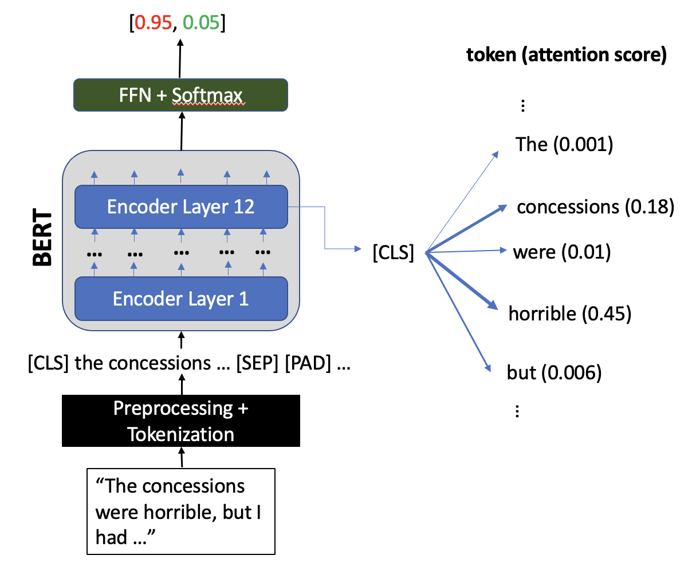

# Feedback Analysis
Feedback Analysis is a tool to analyze textual feedback
and produce short, meaningful highlights that characterize sentiment. This repo contains the code used to design
the underlying NLP system which is discussed in further detail below.
## Motivation
For many organizations, feedback forms are used to measure the quality of experience from a customer or employee's
standpoint. Often times, insights expressed in feedback can help develop new solutions, reinforce positive behavior,
evaluate errors, and promote overall growth for the organization. Therefore, from small clubs to large corporations,
reading feedback is a critical component of enhancing performance.

However, reading a large number of feedback forms can quickly become cumbersome. For instance, in my high school, clubs
received 100-150 responses from students. The officers of that club would have to read hundreds of paragraphs, and a lot
of this time was spent on reading unimportant details. Motivated by this, I developed this tool to analyze feedback and
highlight spans of text that express strong sentiment, as this is where feedback is likely to be useful.

## Task
As large transformer-based models gain popularity in the NLP community, 
it becomes increasingly important to develop methods of *explanation* for a model's
prediction. In this project, I aim to produce faithful explanations for sentiment analysis by extracting spans of
text called "rationales." By showing that these rationales alone are sufficient to produce the same prediction as when
given the full input text, it's clear that the selected rationales concisely capture the sentiment of the full text. 

Inspired by the above approach[1], 
this project aims to define a select-predict framework consisting of a feature scoring module, rationale extraction 
module, and a final prediction module.

## Data
All dataset information and data processing routines can be found in `./data`

Some preprocessing is done (for messy input texts from Twitter dataset, for instance), but the text is not
tokenized or heavily filtered. 

## Models
The general pipeline is:
1. Text is preprocessed, then tokenized appropriately based on model being used
2. `./models/featurescorer.py` A **feature scoring model** assigns feature importance scores (i.e. \[CLS\] attention) to all input tokens. This 
model is trained end-to-end on the binary sentiment prediction task.
3. `./models/extractor.py` An **extraction model** uses the feature importance scores to highlight contiguous spans of text. These spans or
"rationales" are then aggregated in a new training dataset of only rationales.
4. `./models/predictor.py` A **prediction model** is trained using the new dataset on a multi-class sentiment analysis task. The outputs of this
model are used in conjunction with the full-text sentiment prediction in a scoring function to evaluate various
emotional elements of the text.
### Feature Scorer

Pretrained BERT is fine-tuned on the binary sentiment classification task. The type of sentiment classification
does not matter here - binary sentiment was used due to the availability of high-quality training examples.
The goal is to simply shift model parameters
such that spans of text that strongly reflect sentiment are heavily weighted. Since BERT uses
self-attention, a representation of the entire input is often given in reference to the \[ClS\] token, so
\[CLS\] attention scores in the second-to-last BERT layer are used as feature importance scores. Other feature scoring methods are also viable, but BERT attention seems to produce the best
final rationales. However, if this model is trained end-to-end on the task of interest,
we remove the added complexity of joint training with an extractor module.
### Extractor
The separate extractor model uses the feature importance scores derived above to generate a 
binary mask over the input tokens. In other words, each token is either included or excluded
from being part of the "rationale". Ideally, these masks should be as concise as possible.

Models developed:
- Heuristic: Simply selects the top few contiguous sequences of tokens with the 
  highest attention sum. Ensures contiguous pieces are not too close to each other.
- BiLSTM: Takes concatenated BERT embedding + attention score input vectors. Outputs 
  binary probabilities (select/don't select) for each token. 
 Training: 
  - Supervise training by using output of Heuristic model (1/0 binary mask) as the target. Objective is NLL loss.
  - Train using reinforcement-learning type framework, with a loss function defined by contiguity, conciseness,
    and decaying attention sum terms (hyperparameter search is very hard)
- BiLSTM + CRF: Same as BiLSTM trained on outputs of Heuristic model, but with a Conditional
Random Field (CRF) layer attached. This results in more coherent rationale selections.
### Predictor
The predictor model analyzes sentiment for each extracted rationale for a given input text. This model is trained 
on multi-class sentiment analysis from the SST-5 dataset.
Models developed:
- DAN Pred: A simple deep averaging network which averages BERT embeddings of rationales. Works
decently and is fast to train.
- BERT Pred: Encodes rationales once again through pretrained BERT, fine-tuned on more advanced
sentiment task. Large language models so training isn't as fast.

## TODO
- (DONE) write processing for SST data, also write function to process text larger than 512 tokens (currently truncated) 
- finalize the scoring function, test model on Amazon dataset
- see if model can be trained on other sentiment-based tasks (i.e. sensing urgency or sarcasm), or transfer learning
- package code and set up beta version of web app with AWS
- create Chrome extension for this product (can apply on Google sheets/Google Form responses)

## References
[1] Jain, Sarthak & Wiegreffe, Sarah & Pinter, Yuval & Wallace, Byron. (2020). Learning to Faithfully Rationalize by Construction. 4459-4473. 10.18653/v1/2020.acl-main.409. 
[2] Tao Lei and Regina Barzilay and Tommi S. Jaakkola (2016). Rationalizing Neural PredictionsCoRR, abs/1606.04155.